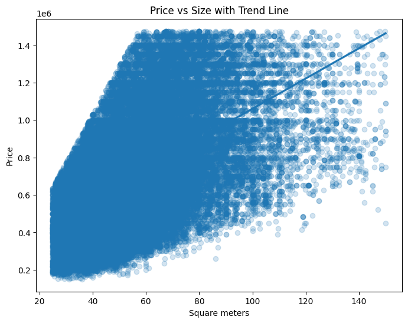
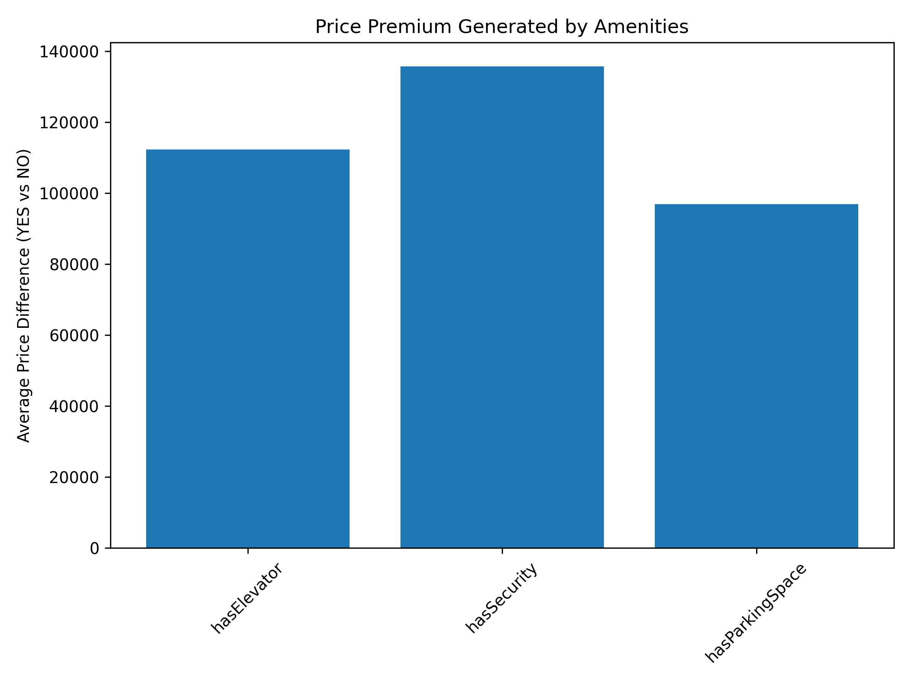

# Real Estate Price Analysis – Poland

## Project Overview

This project presents an end-to-end analytical study of the Polish residential real estate market.  
The objective was to identify the key drivers influencing apartment prices and quantify their impact using statistical analysis and a predictive model.

The analysis includes:
- data cleaning and preprocessing,
- exploratory data analysis (EDA),
- correlation assessment,
- feature impact evaluation,
- linear regression model for price prediction.

The results provide insights into how property characteristics and amenities influence market valuation.

## Business Problem

Real estate pricing depends on multiple structural and locational factors.  
Understanding which features significantly influence price is critical for:

- property valuation,
- investment decision-making,
- pricing strategy optimization,
- market segmentation analysis.

The goal of this project is to determine which apartment attributes generate the strongest price premium.

## Relationship Between Apartment Size and Price

The analysis shows a clear positive relationship between apartment size and total property price. As square meters increase, the overall price of the apartment rises, which is confirmed by the upward-sloping regression line.

The Pearson correlation coefficient of 0.535 indicates a moderate positive relationship. This suggests that apartment size is a significant pricing factor, though it does not fully explain price variability.

The dispersion of observations around the regression line highlights that properties with similar size may differ substantially in price. This implies that additional factors — such as location, building standard, and amenities — also contribute meaningfully to final property valuation.

Overall, apartment size is a key, but not exclusive, determinant of residential real estate pricing.

## Interpretation of the Regression Plot

The scatter plot with the regression line confirms a clear positive relationship between apartment size and total price. As the number of square meters increases, property prices tend to rise accordingly.

The upward-sloping trend line indicates that apartment size is a significant driver of total valuation. However, the visible dispersion of data points suggests that properties of similar size may still vary considerably in price, highlighting the influence of additional factors such as location, building standard, and amenities.

Overall, size represents a key structural determinant of price, though it does not fully explain market variability.

## Relationship Between Number of Rooms and Price

The analysis indicates a positive relationship between the number of rooms and apartment price. Properties with more rooms generally achieve higher total prices, which is also reflected in the increasing average price across room segments.

The Pearson correlation coefficient of 0.425 suggests a moderate positive association — the number of rooms contributes to price variation, but its explanatory power is weaker than apartment size. This is expected, as the number of rooms is often correlated with square meters, and price differences are additionally driven by location and property standard.

Overall, room count is a relevant pricing factor, but it should be interpreted together with apartment size and other property attributes.

## Relationship Between Number of Rooms and Price

The bar chart presents the average apartment price by number of rooms. The results show a clear upward trend — properties with a higher number of rooms achieve higher average market prices.

This confirms that room count is an important structural determinant of total property value. However, its impact is partially driven by its correlation with apartment size, which remains the primary pricing factor.

From a business perspective, room segmentation can support pricing strategy and market positioning, particularly when targeting specific buyer groups.

## Relationship Between Distance from City Centre and Price

The analysis indicates a weak relationship between apartment price and distance from the city centre. While classical market theory suggests that properties located closer to the centre command higher prices, the regression line reveals only a marginal trend in this dataset.

The low correlation coefficient confirms that distance alone does not strongly determine pricing. This suggests that other structural and qualitative factors — such as apartment size, building standard, and amenities — play a more substantial role in price formation.

Interpretation of the Regression Plot

The regression plot illustrates a weak relationship between apartment price and distance from the city centre. Although a slight upward trend is visible, the regression line is relatively flat, indicating that distance alone does not strongly determine pricing.

The substantial dispersion of observations across all distance levels suggests that properties located at similar distances from the centre may vary significantly in price. This implies that additional factors — such as apartment size, building quality, and amenities — play a more influential role in price formation.

Overall, distance from the city centre appears to have limited standalone explanatory power in this dataset.

## Impact of Amenities on Apartment Price
Section Overview

This analysis evaluates how selected building amenities influence apartment prices.
The comparison is based on average price differences between properties with and without a given amenity.

## Chart Description

The bar chart presents the average apartment price depending on the presence of specific amenities.
The results indicate that amenities enhancing comfort and security — such as:

elevator access,

security services,

parking space availability

are associated with higher average property prices.
A higher bar for properties with a given amenity suggests the presence of a price premium. This confirms that building standard and functional improvements are positively valued by the market.

## Business Insight

From a market perspective, amenities act as value-enhancing differentiators.

Investments in building infrastructure and security features may translate into measurable price premiums, making them strategically relevant for developers, property investors, and sellers aiming to optimize pricing and competitiveness.

## Correlation Matrix

The correlation matrix provides a comprehensive overview of linear relationships between all numerical variables in the dataset. It allows for quick identification of features that are strongly associated with apartment price.

# Interpretation
The matrix confirms that:
Apartment size (square meters) shows the strongest positive correlation with price,
Number of rooms also demonstrates a moderate positive relationship,
Distance from city centre exhibits a weak relationship with price,
Building characteristics and amenities have varying but generally weaker direct correlations.
The heatmap visualization highlights both the strength and direction of these relationships, where warmer colors indicate positive correlations and cooler tones indicate negative ones.

## Business Insight

The correlation analysis suggests that structural attributes — particularly size — are the primary quantitative drivers of price formation.

However, the moderate strength of correlations indicates that pricing is multidimensional and influenced by a combination of physical, locational, and qualitative factors.

This justifies the use of a multivariate predictive model rather than relying on single-variable analysis.

## Predictive Model (Linear Regression)

A linear regression model was built to estimate apartment prices based on structural and building-related features (size, rooms, distance to centre, floor, build year, and selected amenities).

Model performance:
- R²: 0.38
- MAE: ~164,000 PLN

The results suggest that apartment size and building amenities (especially elevator and security) have the strongest impact on predicted price. The model captures general pricing patterns, but the remaining unexplained variance indicates that additional factors (e.g., neighborhood-level location, property condition, finishing standard) are likely required for higher predictive accuracy.

## Final Conclusions

This end-to-end real estate price analysis project explored the structural and locational drivers of apartment pricing in Poland. Through thorough data cleaning, exploratory data analysis, correlation assessment, and predictive modeling, we identified key factors influencing market valuation.

The results demonstrate that apartment size and building amenities (elevator, security, parking) are significant drivers of price, while distance from the city centre exhibited a comparatively weaker relationship. The predictive model captured major pricing trends and highlighted how different features contribute to price variation.

Although the model explains a portion of price variability, the remaining unexplained variance suggests that additional detailed locational features (e.g., neighborhood, accessibility) and qualitative property characteristics (e.g., condition, finish level) could further enhance predictive accuracy.

Overall, this project showcases a structured analytical workflow and provides actionable insights for stakeholders in real estate analytics, pricing strategy development, and property valuation.

